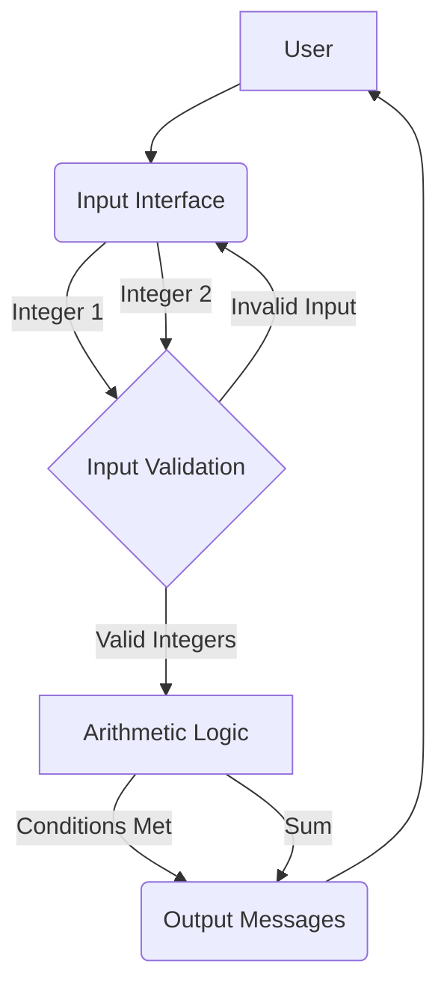

# cpp-int-arithmetic-robustness

A C++ project demonstrating fundamental integer arithmetic, conditional logic, comprehensive input validation, and robust integer overflow detection in an iterative learning context.

## Overview

This project explores the nuances of integer arithmetic in C++, focusing on robust input handling and the critical issue of signed integer overflow. It adopts an iterative learning approach, starting with basic concepts and progressively refining the implementation to achieve production-grade robustness. Key areas covered include:

*   Basic C++ I/O and conditional statements (`if/else if`).
*   Understanding and avoiding Undefined Behavior (UB) related to signed integer overflow.
*   Implementing robust input validation to handle non-numeric input and stream errors.
*   Techniques for detecting and preventing integer overflow *before* it occurs.
*   Crafting clear and unambiguous error messages.

## Architecture Diagram

This simple architecture illustrates the main components of the application.



## Concepts Covered

*   C++ Standard Library (iostream, limits)
*   Conditional logic (`if`, `else if`, `else`)
*   Function design and modularity
*   Robust input parsing and error handling
*   Signed integer overflow rules and Undefined Behavior (UB)
*   Pre-computation checks for overflow prevention
*   `std::numeric_limits<int>::max()` and `std::numeric_limits<int>::min()`
*   `long long` for intermediate calculations
*   `CMake` build system basics

## Learning Journey

This project is structured as an iterative learning path. Each step addresses a specific aspect of robustness and correctness.

### 1. Initial Implementation - Core Logic (Demonstrating Potential Pitfalls)

**Objective:** Understand basic `std::cin`, `std::cout`, and `if/else if` structures. Implement the initial problem conditions including a naive overflow check.

**Approach:** Implement the core logic as initially described, including the `(int1 + int2 < 0)` check for overflow when both inputs are positive.

**Key Learning:** Basic C++ I/O and conditional logic.

**Crucial Discussion:** The overflow detection method `(int1 + int2 < 0)` when both inputs are positive relies on **Undefined Behavior (UB)** in C++. This means the compiler is allowed to do anything, making the program unpredictable and non-portable. This initial step is included to highlight *why* this is problematic, setting the stage for the correct solution in step 3.

```cpp
// Conceptual code for initial overflow check (UB-prone)
// int a, b;
// ... (get a and b)
// if (a > 0 && b > 0 && a + b < 0) { // UB here!
//     std::cout << "Potential overflow detected (UB-prone check).
";
// }
```

### 2. Robust Input Validation

**Objective:** Enhance the program to handle non-numeric input and `std::cin` stream failures, making it more user-friendly and resilient.

**Approach:** Implement a loop that repeatedly prompts the user until valid integer input is received. This involves checking `std::cin.fail()`, clearing the error state (`std::cin.clear()`), and discarding invalid input (`std::cin.ignore()`).

**Key Learning:** Essential user input handling, understanding `std::istream` error states, and basic input loop patterns. This prevents program crashes or incorrect behavior due to bad user input.

**Further Consideration:** For truly robust systems, you might also consider reading input into a `std::string` first, then parsing it to handle values exceeding `INT_MAX` or falling below `INT_MIN` before attempting to convert to `int`. This example directly reads into `int` and handles basic stream failures.

### 3. Correct Integer Overflow Detection

**Objective:** Replace the UB-prone overflow check with a robust method that detects potential overflow *before* the addition occurs, ensuring well-defined behavior.

**Approach:** Instead of relying on `a + b < 0`, we check `if (a > std::numeric_limits<int>::max() - b)` for positive `a` and `b`. This check determines if adding `b` to `a` would exceed `INT_MAX` without actually performing the operation that could lead to UB. Similar checks apply for negative numbers.

**Key Learning:** Understanding signed integer overflow rules in C++, practical techniques for pre-checking for overflow, and the paramount importance of avoiding Undefined Behavior. This is a critical lesson for writing reliable C++ code.

**Alternative/Discussion:** Using `long long` for intermediate calculations is another common strategy. If `(long long)a + b` is computed, it's less likely to overflow and can then be compared against `INT_MAX` or `INT_MIN` to determine if it fits within an `int`. This method simplifies the pre-check logic but changes the intermediate type. Our implementation focuses on pre-checking with `int` types.

### 4. Refined Output Messaging

**Objective:** Ensure all messages are clear, precise, and unambiguous, especially when multiple conditions could apply hierarchically.

**Approach:** Carefully craft `std::cout` statements to explicitly state which condition was met. If overflow is detected, clearly differentiate between the "mathematical sum" (what the sum *should* be) and the "computed sum" (the potentially wrapped-around value).

**Key Learning:** Clarity in user communication, handling edge cases in output, and the importance of a well-defined reporting strategy.

## Build and Run Instructions

This project uses CMake for build management.

1.  **Clone the repository:**
    ```bash
    git clone https://github.com/aastom/cpp-int-arithmetic-robustness.git
    cd cpp-int-arithmetic-robustness
    ```

2.  **Create a build directory and configure CMake:**
    ```bash
    mkdir build
    cd build
    cmake ..
    ```

3.  **Build the project:**
    ```bash
    cmake --build .
    ```

4.  **Run the executable:**
    ```bash
    # On Linux/macOS
    ./src/int_checker

    # On Windows
    .\src\Debug\int_checker.exe # or Release, depending on configuration
    ```

Alternatively, you can compile `main.cpp` and `input_utils.cpp` directly with a C++17 compliant compiler:

```bash
g++ -std=c++17 src/main.cpp src/input_utils.cpp -o int_checker
./int_checker
```

## Usage Examples

Here are some example interactions with the `int_checker` program:

**Scenario 1: First integer is negative**
```
Enter the first integer: -5
Enter the second integer: 10
Condition met: The first integer is negative.
The sum of the two integers is: 5
```

**Scenario 2: First integer non-negative, second is negative**
```
Enter the first integer: 8
Enter the second integer: -3
Condition met: The first integer is non-negative, but the second is negative.
The sum of the two integers is: 5
```

**Scenario 3: Both non-negative, no overflow**
```
Enter the first integer: 100
Enter the second integer: 200
The sum of the two integers is: 300
```

**Scenario 4: Both non-negative, potential overflow detected**
```
Enter the first integer: 2147483647 (INT_MAX)
Enter the second integer: 1
Condition met: Potential integer overflow detected (both inputs positive).
Mathematical sum would exceed INT_MAX.
The computed sum of the two integers is: -2147483648 (wrapped around due to overflow)
```

**Scenario 5: Invalid input**
```
Enter the first integer: abc
Invalid input. Please enter an integer.
Enter the first integer: 123
Enter the second integer: -xyz
Invalid input. Please enter an integer.
Enter the second integer: 45
The sum of the two integers is: 168
```

## References

*   [C++ Standard - Integer types](https://en.cppreference.com/w/cpp/language/integer_types)
*   [C++ Standard - `std::numeric_limits`](https://en.cppreference.com/w/cpp/limits/numeric_limits)
*   [Undefined Behavior in C++](https://en.cppreference.com/w/cpp/language/ub)
*   [Safe Integer Operations (Wikipedia)](https://en.wikipedia.org/wiki/Integer_overflow#Detection)
*   [CMake Documentation](https://cmake.org/documentation/)
