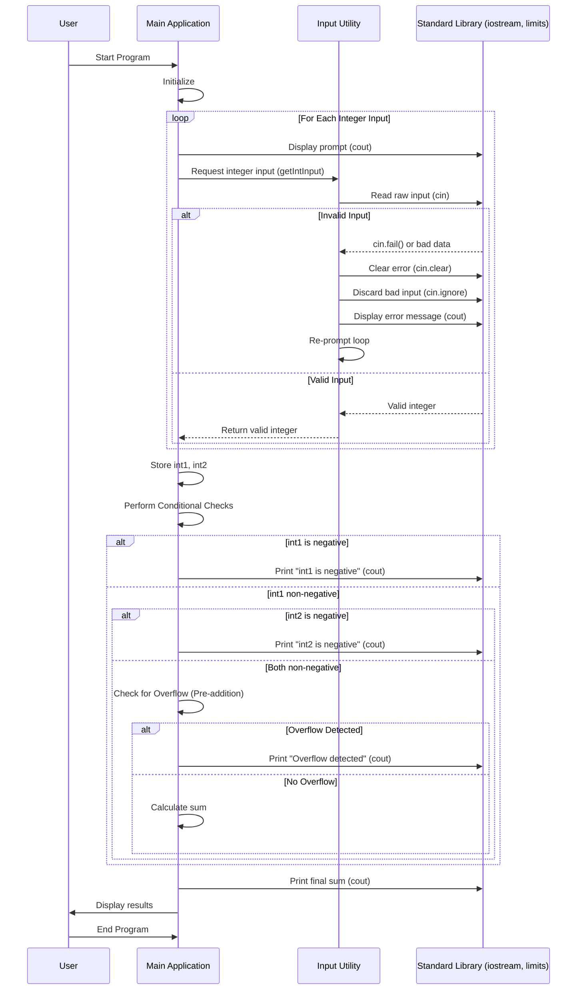

# Project Architecture: Robust Integer Arithmetic Checker

This document details the architectural design of the `cpp-int-arithmetic-robustness` project. The core design principles revolve around modularity, robust input handling, and strict adherence to C++'s defined behavior for integer arithmetic.

## High-Level Component Interaction

At a high level, the application consists of three main logical components:

1.  **Input Utility Module (`input_utils`):** Responsible for robustly acquiring integer input from the user.
2.  **Main Application Logic (`main`):** Orchestrates the input process, performs the conditional checks, and manages the output.
3.  **Standard Libraries:** Provides fundamental functionalities like I/O streams and numeric limits.

## Detailed Workflow (Sequence Diagram)

The following sequence diagram illustrates the interaction between these components from program start to finish for a single execution cycle.

## Component Breakdown

### `src/main.cpp`

*   **Role:** The entry point of the program. It orchestrates the flow, calls input functions, applies the specified conditional logic, and manages the output.
*   **Key Responsibilities:**
    *   Call `getIntInput` from `input_utils.hpp` to get two integers from the user.
    *   Implement the hierarchical conditional checks (negative `int1`, negative `int2`, overflow).
    *   Perform the sum calculation (only if no overflow is detected or for informational purposes).
    *   Print all relevant messages and the final sum.
*   **Dependencies:** `input_utils.hpp`, `<iostream>`, `<limits>`, `<string>`. 

### `src/input_utils.hpp`

*   **Role:** Defines the interface for utility functions related to robust user input.
*   **Key Function:** `int getIntInput(const std::string& prompt)`
*   **Dependencies:** `<string>`. 

### `src/input_utils.cpp`

*   **Role:** Implements the robust input utility functions declared in `input_utils.hpp`.
*   **Key Responsibilities:**
    *   Display a given `prompt` to the user.
    *   Read user input using `std::cin`.
    *   Handle `std::cin` stream failures (non-numeric input, overflow/underflow for `int`).
    *   Clear error flags and discard invalid input from the buffer.
    *   Re-prompt the user until valid integer input is provided.
*   **Dependencies:** `<iostream>`, `<limits>`, `<string>`. 

## Technical Constraints and Design Decisions

*   **C++ Standard:** C++17 is used to ensure compatibility with modern compilers while not requiring the absolute latest features.
*   **Input Handling:** A dedicated `input_utils` module promotes reusability and separates concerns, making the `main` logic cleaner. The input loop ensures that the program only proceeds with valid integer data.
*   **Overflow Detection:** The design explicitly avoids Undefined Behavior by checking for potential overflow *before* performing the addition using pre-computation checks (e.g., `a > INT_MAX - b`). This is a critical safety measure in C++ integer arithmetic.
*   **Modularity:** Separating input utilities into their own files (`.hpp` and `.cpp`) enhances code organization and testability.
*   **Error Messaging:** Output messages are designed to be clear and informative, especially regarding overflow conditions, distinguishing between mathematical and computed sums.
*   **No External Libraries:** The project relies solely on the C++ Standard Library, keeping it lightweight and easy to compile across various environments.
